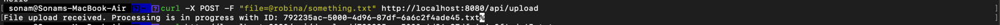
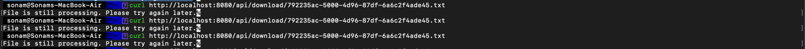

# File processng service
An application that exposes endpoint to uploaded files that can be stored in the file system and in-memory datatype can be used to persist the processed files.


## How to run
Prerequisite: `JAVA_HOME` is set

This is a spring boot application and can be run directly from source directory using java command. The project should start on port `8080`
```shell
 java -jar target/demo-0.0.1-SNAPSHOT.jar 
```
From any terminal , run below command to upload a file from local. for example to upload a file from /tmp/something.txt, run below command
```shell
curl -X POST -F "file=@/tmp/something.txt" http://localhost:8080/api/upload
```
For every file, a unique ID is generated. You should see an output like this - 

```text
File upload received. Processing is in progress with ID: e98e4944-38a1-4384-a3cc-05434da0c0a6.txt%
```

```shell
curl http://localhost:8080/api/download/792235ac-5000-4d96-87df-6a6c2f4ade45.txt
```

For now there's a dummy implementation of 60 seconds delay to simulate processing of a file.

If you try to download the file using download API
```shell
curl http://localhost:8080/api/download/792235ac-5000-4d96-87df-6a6c2f4ade45.txt
```
you should see this response
```text
File is still processing. Please try again later
```

but after 60 seconds, when mock finishes, curl will give you output of the file


## HTTP Status codes
| HTTP Status Code | Message               |
|------------------|-----------------------|
| 200              | OK                    |
| 201              | Accepted              |
| 400              | Bad Request           |
| 404              | Not Found             |
| 500              | Internal Server Error |
| 503              | Service Unavailable   |
| 423              | In progress           |


## Error handling
All specific and generic exceptions are being handled via `@ControllerAdvice`

## TODO
1. CSV /txt processing.
2. Tests
3. Health checks
4. Create a Postman request collection file.
5. 